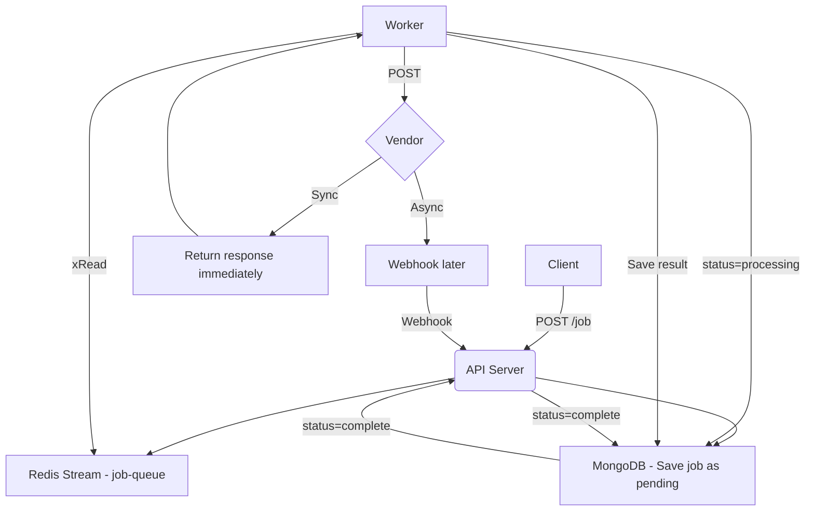

# 📦 Multi-Vendor Data Fetch Service

A distributed backend system that handles synchronous and asynchronous data-fetching jobs from multiple vendors. Built using Node.js, Redis Streams, MongoDB, and Docker Compose. Supports background processing, webhooks, rate-limit resilience, and job tracking.

---

## 🛠 Tech Stack

* **Node.js + Express** — API server and background worker
* **MongoDB** — Persistent storage for job metadata and results
* **Redis Streams** — Job queue and inter-service communication
* **Docker Compose** — Multi-container orchestration
* **Axios** — HTTP requests to vendors

---

## 🚀 Getting Started (with Docker)

```bash
git clone <your-repo-url>
cd Multi_Vendor_Data_Fetch
docker-compose up --build
```

The following services will start:

* `api` — Express API (port **4000**)
* `worker` — Background worker
* `vendor-sync` — Mock sync vendor (port **6001**)
* `vendor-async` — Mock async vendor (port **6002**)
* `mongo` — MongoDB (port **27017**)
* `redis` — Redis server (port **6379**)

---

## 🔁 Flow Overview



---

## 📨 API Endpoints

### `POST /jobs`

**Description:** Submit a new job to be processed by either a sync or async vendor.

**Request Body:**

```json
{
  "name": "testUser",
  "email": "test@mail.com",
  "password": "password"
}
```

**Response:**

```json
{
  "request_id": "<uuid>"
}
```

---

### `GET /jobs/:request_id`

**Description:** Fetch the status and result of a previously submitted job.

**Example:**

```bash
curl http://localhost:4000/jobs/be998dff-859e-4cd8-9393-825553192545
```

**Response:**

```json
{
  "status": "complete",
  "result": {
    "account": "xyz",
    "balance": 5000
  }
}
```

---

### `POST /vendor-webhook/:vendor`

**Description:** Webhook endpoint for async vendors to return job results.

**Example:**

```bash
curl -X POST http://localhost:4000/vendor-webhook/async \
  -H "Content-Type: application/json" \
  -d '{
    "request_id": "be998dff-859e-4cd8-9393-825553192545",
    "account": "xyz",
    "balance": 5000
  }'
```

**Response:**

```json
{
  "message": "Result saved"
}
```

---

## 👷 Worker Behavior

* Continuously reads Redis Stream (`job-queue`)
* If job is `sync`, makes HTTP request and updates MongoDB
* If job is `async`, deletes stream entry and waits for webhook

---

## 🧪 Testing Locally

### ✅ Create a Sync Job

```bash
curl -X POST http://localhost:4000/jobs \
  -H "Content-Type: application/json" \
  -d '{"name":"TestUser","email":"test@mail.com","password":"pass"}'
```

### ✅ Check Job Status

```bash
curl http://localhost:4000/jobs/<request_id>
```

### ✅ Send Webhook (for async vendor)

```bash
curl -X POST http://localhost:4000/vendor-webhook/async \
  -H "Content-Type: application/json" \
  -d '{
    "request_id": "<request_id>",
    "account": "xyz",
    "balance": 5000
  }'
```

---

## 📁 Folder Structure

```
.
├── api/                  # Main API server
├── worker/               # Background worker
├── mock-vendors/
│   ├── vendor-sync.js    # Synchronous vendor service
│   └── vendor-async.js   # Asynchronous vendor service
├── models/
│   └── job.js            # Mongoose schema for job
├── utiles/
│   └── redisClient.js    # Redis connection utility
├── .env                  # Environment variables
├── docker-compose.yml    # Container setup
└── README.md
```

---

## 🙌 Author

Built with ❤️ by Santosh Rai
